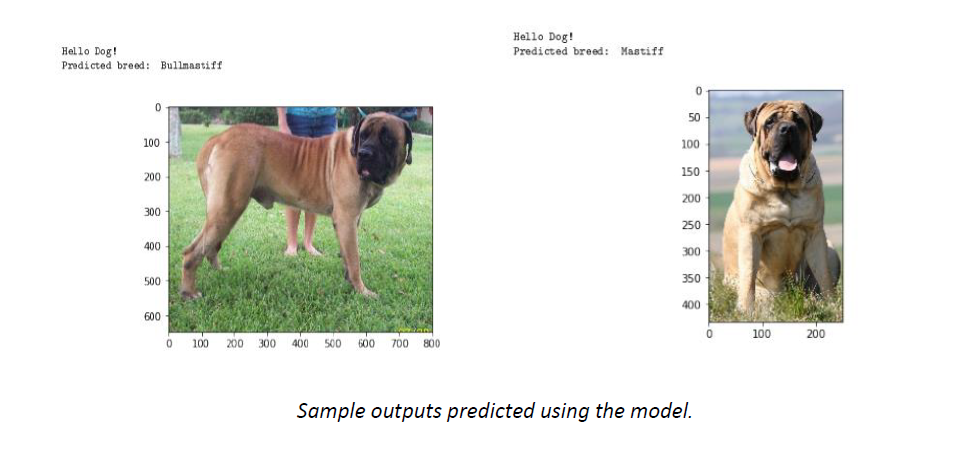

# Dog-breed-classifier using CNN in PyTorch
This is the repo of Dog breed classifier project in Udacity ML Nanodegree. 

## Project Overview

The problem is to identify the breed of dog, if dog image is given as input, if supplied an image of a human, we have to identify the resembling dog breed. The idea is to build a pipeline that can process real world user supplied images and identify an estimate of the canine’s breed. This is a multi-class classification problem where we can use supervised machine learning to solve this problem. 

## Solution

For performing this multiclass classification, we can use <em>Convolutional Neural Network</em> to solve the problem. A Convolutional Neural Network (CNN) is a Deep
Learning algorithm which can take in an input image, assign importance (learnable
weights and biases) to various aspects/objects in the image and be able to
differentiate one from the other. The solution involves three steps. First, to detect
human images, we can use existing algorithm like OpenCV’s implementation of
Haar feature based cascade classifiers. Second, to detect dog-images we will use a
pretrained VGG16 model. Finally, after the image is identified as dog/human, we
can pass this image to an CNN model which will process the image and predict the
breed that matches the best out of 133 breeds.

## CNN model created from scratch

I have built a CNN model from scratch to solve the problem. The model has 3
convolutional layers. All convolutional layers have kernel size of 3 and stride 1. The
first conv layer (conv1) takes the 224*224 input image and the final conv layer
(conv3) produces an output size of 128. ReLU activation function is used here. The
pooling layer of (2,2) is used which will reduce the input size by 2. We have two
fully connected layers that finally produces 133-dimensional output. A dropout of
0.25 is added to avoid over overfitting.

## Refinement - CNN model created with transfer learning

The CNN created from scratch have accuracy of 13%, Though it meets the
benchmarking, the model can be significantly improved by using transfer learning.
To create ** CNN with transfer learning **, I have selected the ** Resnet101 architecture **
which is pre-trained on ImageNet dataset, the architecture is 101 layers deep. The
last convolutional output of Resnet101 is fed as input to our model. We only need
to add a fully connected layer to produce 133-dimensional output (one for each
dog category). The model performed extremely well when compared to CNN from
scratch. With just 5 epochs, the model got 81% accuracy.

 

## Model Evaluation

The CNN model created using transfer learning with
ResNet101 architecture was trained for 5 epochs, and the final model produced an
accuracy of 81% on test data. The model correctly predicted breeds for 680 images out of 836 total images.

**Accuracy on test data: 81% (680/836)**

